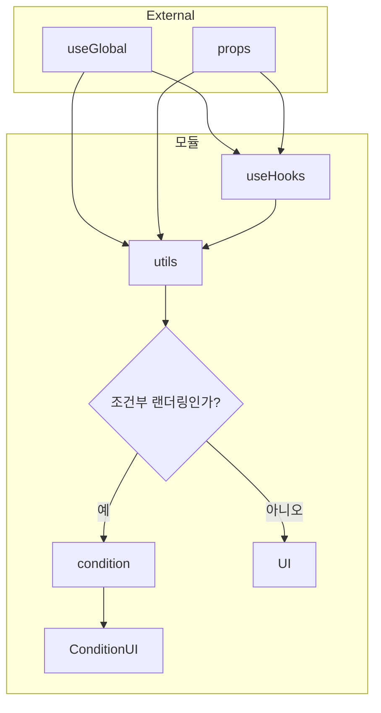

# AI가 리액트 컴포넌트를 체계적으로 짜도록 강제하기

# 문제

- react가 컴포넌트를 어떻게 짜냐에 대해서 강제적인 규칙은 없다. 프레임워크 역시 로직의 추상화를 위한 디렉토리 규칙(nextjs app router등)을 제공하는 수준이지, 내부가 어떻게 짜여야하는지는 강제성있는 규칙이 없다.
- 따라서, AI가 짜는 코드 역시 프로젝트(또는 ai agent 세션)마다 규칙성이 존재하지 않는다. 이는 추후 인간이나 AI 자신이 참조할 때 일관적인 코드를 작성하지 않아 이해를 어렵게 한다.
- 안티패턴을 일삼을 수 있다.
  - 예를들어 UI로직과 비즈니스 로직이 뒤섞인다.
- 코드간 경계를 만들기 어렵다. 관심사(이하 도메인)에 귀속되는 로직이여도 침범하고, 마음대로 사용할 위험성이 존재한다.
  - 코드의 영향범위를 예상하기 어려워진다.
  - 컴포넌트, 도메인간 책임이 모호해진다.

## 달성하고자 하는 것

- 어떤 도메인에 대해 public api와 private api를 명시적으로 선언할 수 있다.
- UI만 선언 가능한 영역과 비즈니스 로직만 선언 가능한 영역이 분리돼있다.
- 이를 강제화 한다.

## 집중하고자 포기할 것

- 프로젝트 전체를 해당 구조로 만드는 방법은 고려하지 않는다.

# 문제 해결

## 컴포넌트 작성 규약



플로차트에서는 `global` 값 노드를 생략하고 `useGlobal`을 `utils`로 직결해 표현한다. 본문에서는 `createUtils({ props, global, useHooks })`처럼 `useGlobal()`의 결과인 `global`을 그대로 쓴다.

### 구성요소

#### props

- 컴포넌트에 전달되는 `props`.

#### useGlobal

- 전역 상태 관리 라이브러리 또는 Context API의 Provider로 외부에서 주입받은 의존성을 `useGlobal()`으로 가져온다.

#### useHooks

- React 생명 주기와 상호작용하는 로직이다. `useHooks(props, global)` 형태로 `props`와 `global`을 받는다(`global`은 `useGlobal()`의 반환값).

#### createUtils

- `createUtils({ props, global, useHooks })`가 렌더링에 맞게 데이터를 가공하는 레이어이다. 반환 객체가 `utils`이다.
- React 생명 주기를 직접 상호작용할 수 없고, `useHooks` 레이어를 통해 추상화된 API만 제공받는다.

#### condition(Optional)

- 조건에 따라 뷰가 달라질 때, 이를 enum 형식으로 선언하고 처리하기 위한 특화 레이어이다. `condition(utils)` 형태로 둔다.
- 다음 문법과 인터페이스만 허용한다: if + return, else if + return, else + return, return

    ```tsx
    const condition = (utils: U): StringEnum => {
      if (조건) return "string";
      else if (조건) return "string";
      else return "string"
      return "string"
    }
    ```

#### ConditionUI

- `condition`에서 받은 string enum을 처리한다. `ConditionUI(utils, condition)` 형태로 둔다.
- 다음 문법과 인터페이스만 허용한다: case + return, case, default + return

    ```tsx
    const getView = (condition:StringEnum):ReactNode => {
      switch(condition){
        case value:
          return <View/>
        case value:
        default:
          return <View/>
      }
    }
    ```

#### UI

- `UI(utils)`로 둔다. jsx는 [implicit return](https://demirels-organization.gitbook.io/javascript-tutorial/implicit-return)만 가능해 비즈니스 로직이 들어오는 것을 차단한다.
- 모든 데이터는 이전 레이어에서 처리되고, 렌더하는 책임만 진다.

## 도메인 export

- 외부에서 import는 index.tsx에서만 가능하다. 정확히 말하자면, 다른 관심사에서 다른 관심사와 결합이 생길시 {관심사}/index.tsx 에서 export되는 항목만 import 가능하다.
- 다른 파일에서 import하는 것은 비허용한다.

## 결과

```markdown
- {관심사1}
  - {관심사}.tsx // 작성 규약을 지킨 컴포넌트
  - util.ts // 컴포넌트의 각 레이어에서 파일로 선언하거나, 인라인으로 선언한다.
  - util.text.ts // 각 레이어별로 테스팅이 가능하다.
  - type.ts // optional
  - {관심사}.css // optional
  - index.tsx // public api를 export한다.
  
- {관심사2}
  - util.ts
```
