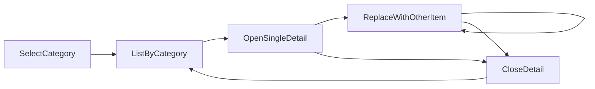

# 바 메뉴 서비스 — 마스터 기획 (비즈니스 요구사항)

이 문서는 구현 기술이 아니라 **손님 관점의 규칙·시나리오·화면 책임**만 정의한다. 화면을 코드로 옮길 때 도메인 경계와 세션 전역 상태에 대한 공통 규약은 저장소 루트의 [`docs.md`](../docs.md)를 따른다.

## 관련 스펙

| 분류 | 문서 |
|------|------|
| 칵테일 | [`cocktail/SPEC.md`](cocktail/SPEC.md) |
| 위스키 | [`whisky/SPEC.md`](whisky/SPEC.md) |
| 와인 | [`wine/SPEC.md`](wine/SPEC.md) |

## 서비스 한 줄

매장 바에서 손님이 **주종별로 메뉴를 탐색**하고, 항목을 선택하면 **주종에 맞는 상세 정보**를 확인할 수 있는 디지털 메뉴 서비스다.

## 명시적 비포함

다음은 본 서비스 요구사항에 **포함하지 않는다**.

- 즐겨찾기·관심 메뉴
- 직원 전용 모드(가격 수정, 품절 토글 등)

## 메뉴 분류

메뉴는 세 가지 분류로 나뉜다. 각 분류는 **그 주종에 맞는 정보 항목**(목록 표시 차원, 상세 필드)을 가진다. 구체적인 표시 항목과 예시 메뉴는 위 표의 서브 스펙을 따른다.

| 분류 | 설명 |
|------|------|
| 칵테일 | 베이스 스피릿·믹스·서빙 방식 중심의 혼합 음료 |
| 위스키 | 증류 원료·지역·숙성 등으로 구분되는 증류주 |
| 와인 | 포도 품종·스타일·서빙 단위(잔/병 등)가 중요한 와인 |

## 공통 사용자 흐름

1. 손님이 **메뉴 분류** 중 하나를 선택한다.
2. 해당 분류의 **목록**을 본다.
3. 목록에서 **항목**을 선택하면 **상세**가 열린다.
4. 상세에서 닫기 동작을 하거나, 목록에서 **다른 항목**을 선택한다.
5. 분류를 바꿔 다른 주종 목록으로 이동할 수 있다.

아래 「단일 오버레이 상세」 규칙에 따라, 어느 시점에서도 **열린 상세는 하나 이하**다.

## 단일 오버레이 상세 (필수)

- 동시에 열 수 있는 상세 화면은 **최대 하나**다. 여러 개를 겹쳐 쌓거나 나란히 띄우지 않는다.
- 상세가 이미 열린 상태에서 다른 메뉴 항목을 선택하면, **기존 상세는 닫힌 것으로 간주한 뒤** 새 항목의 상세 **하나만** 연다(덮어쓰기).
- **베이스 화면**: 분류 선택과 목록은 상세가 열려 있어도 뒤에서 유지되는 **기준 탐색 화면**이다. 상세를 닫으면 손님은 다시 목록 맥락으로 돌아온다.
- **스크롤·포커스**: 상세를 닫았을 때 목록의 스크롤 위치를 그대로 유지할지, 마지막으로 연 항목으로 스크롤할지 등은 운영 UX 정책으로 한 줄만 정하면 된다(본 스펙에서는 “일관되게 한 가지 방침을 택한다” 수준으로 충분하다).

이 전제는 구현 시 **목록 레이어와 단일 상세 레이어**를 분리해 다루기 쉬운 시나리오다.

## 공통 비즈니스 규칙

### 품절·비노출

- **품절**: 목록에는 표시하되 “품절” 등으로 구분 가능해야 한다. 품절 항목의 상세 진입을 허용할지(설명만 보기) 막을지는 매장 정책으로 정한다. 본 스펙의 기본 가정은 **진입은 허용하되 주문 불가임을 상세에서 명확히 표시**하는 것이다.
- **비노출**(메뉴에서 완전히 숨김): 목록과 상세 모두 손님에게 나타나지 않는다.

### 가격·용량

- 가격은 통화 단위와 함께 표기한다.
- 잔·병·샷 등 **판매 단위**는 주종별로 의미가 다르므로, 각 서브 스펙에서 허용 단위와 목록/상세 노출 규칙을 정한다.

### 알코올 도수·알레르기 유발 재료

- **도수(ABV)**: 가능한 항목에는 표시한다. 칵테일은 계산·표기 방식이 매장마다 다를 수 있으므로 서브 스펙 또는 내부 운영 기준으로 둔다.
- **알레르기**: 재료에 알레르기 유발 성분이 알려진 경우, 운영 정책에 따라 상세에 안내 문구를 둔다. 법적 표기 의무는 지역 법규에 따르며, 본 문서는 그 **최소한을 대신하지 않는다**.

## 세션 전역에서 일관되게 가져야 하는 상태 (비즈니스 요구)

여러 UI 조각이 같은 사용자 경험을 보여 주려면, 아래는 **한곳의 진실**로 두고 목록·상세·분류 전환 모두가 같은 정보를 참조해야 한다.

| 영역 | 요구사항 | 목록·상세가 같은 상태를 봐야 하는 이유 |
|------|----------|----------------------------------------|
| 현재 열린 상세 | 열림 여부는 **없음 또는 하나**. 열린 경우 어떤 메뉴 항목인지, 닫기·다른 항목으로 바꾸기 규칙은 위 「단일 오버레이 상세」와 동일해야 한다. | 목록에서 선택한 결과와 화면에 떠 있는 상세가 어긋나면 혼란·중복 상세가 발생한다. |
| 현재 분류(탭) | 손님이 마지막으로 본 메뉴 분류를 기억하고, 같은 세션에서 서비스를 다시 볼 때 **그 분류부터** 보여준다(예: 앱 내 뒤로 가기·재진입 시). | 분류 탭과 목록 내용이 불일치하면 잘못된 주종 메뉴를 고르게 된다. |

구체적인 저장 방식(브라우저 저장소 등)은 기술 결정이므로 본 스펙에는 적지 않는다.

## 사용자 시나리오 다이어그램 (참고)

## 용어

- **항목**: 목록의 한 줄에 해당하는 판매 단위(칵테일 한 잔, 위스키 한 종, 와인 한 라인 등).
- **상세**: 선택한 항목의 부가 정보를 보여 주는 **단일 오버레이** 화면.
